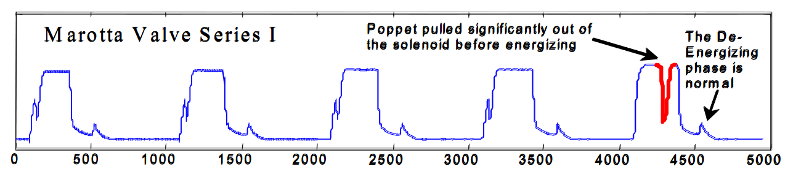
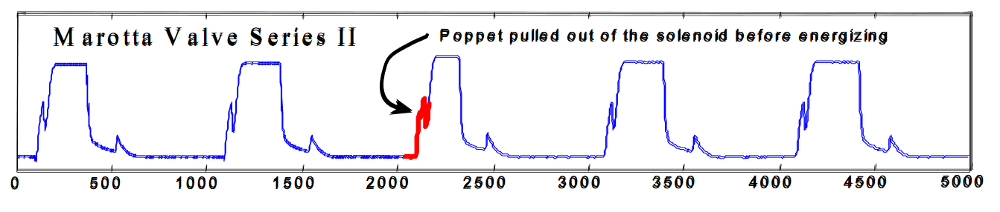

<h1 align="center">hotsax</h1>

<div align="center">
<sub>
An implementation of the HOTSAX discord discovery algorithm.
</sub>
</div>

<br/>

<div align="center">
  <a href="https://crates.io/crates/hotsax">
    
  </a>
   <a href="https://docs.rs/crate/hotsax">
    
  </a>
</div>

<br/>

This crate contains an implementation of the HOT SAX algorithm, and
the brute force algorithm, as proposed by [Keogh et al.](http://www.cse.cuhk.edu.hk/~adafu/Pub/icdm05time.pdf).
It also includes the [HS-Squeezer](https://dl.acm.org/doi/abs/10.1145/3287921.3287929) algorithm,
since it offers useful optimizations, while still being heavily based on the HOT SAX algorithm.
However, from testing, the performance of this implementation is similar or worse than HOT SAX.
If you find any possible optimizations, please open an issue.

During the implementation some other functions had to be made, such as `paa`, `znorm`, and
`gaussian`. These functions are exposed, due to their utility apart from being used in HOT SAX.

The code is well commented in order to explain the implementation, in the case that people want
to learn how the HOT SAX algorithm works by looking at an implementation. If a part is vaguely
commented, feel free to leave an issue.

Note that only `Float` vectors are supported. If your data is made up of integers, you need to
convert it to float first.

### Example of use
```rust
use std::error::Error;
use plotly::{Plot, Scatter};

// Parses the CSV file from the dataset.
let mut rdr = csv::ReaderBuilder::new()
    .trim(csv::Trim::All)
    .from_path("data/TEK16.CSV")?;

// Deserialize CSV data into a vector of floats.
let mut data : Vec<f64> = Vec::new();
for result in rdr.deserialize() {
    data.push(result?);
}

// Prepare a plot
let mut plot = Plot::new();

// Retrieve the largest discord. This should approx. match the one found in the paper.
// It uses the same settings: a discord size of 256 and a=3.
// word_size was assumed to be 3.
let discord_size = 256;
let discord = hotsax::Anomaly::with(&data, discord_size)
    .use_slice(1000..)      // Skips the beginning due to an abnormality.
    .find_largest_discord() // Finds the largest discord in the subslice.
    .unwrap().1;            // Only gets the location.

// Plot the entire dataset as a blue color.
let trace1 = Scatter::new((1..=data.len()).collect(), data.clone())
    .line(plotly::common::Line::new().color(plotly::NamedColor::Blue))
    .name("Data");

// Plot the discord itself as a red color.
let trace2 = Scatter::new((discord+1..discord+discord_size+1).collect(), data[discord..discord+128].to_vec())
    .line(plotly::common::Line::new().color(plotly::NamedColor::Red))
    .name("Discord");

// Add traces to the plot.
plot.add_trace(trace1);
plot.add_trace(trace2);

// Shows the plot to verify.
plot.show();
```

## Evaluation
To show the accuracy of the implementation, the algorithm was run on the same
dataset as used in the paper itself. Specifically, data from Figure 6 and Figure 7
(as can be retrieved [here](https://www.cs.ucr.edu/~eamonn/discords/), or from the `data/`
directory of this repository as `TEK16.CSV` and `TEK17.CSV` respectively.

The algorithm was ran with a word size of 3, an alphabet size of 3, and a discord size of 128.

Below show the results of this algorithm, compared with the figures shown in the paper.





